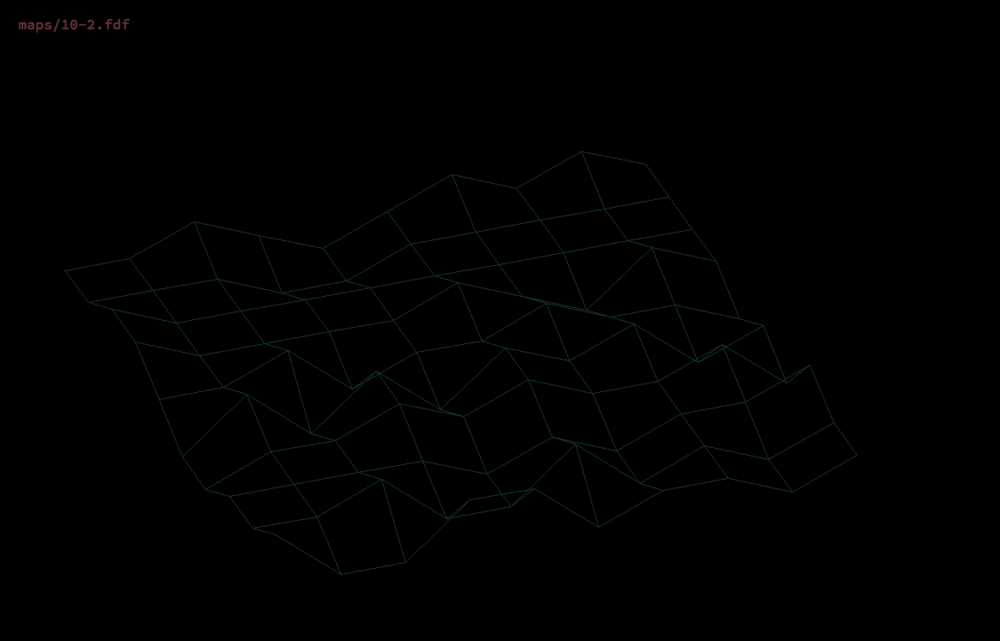
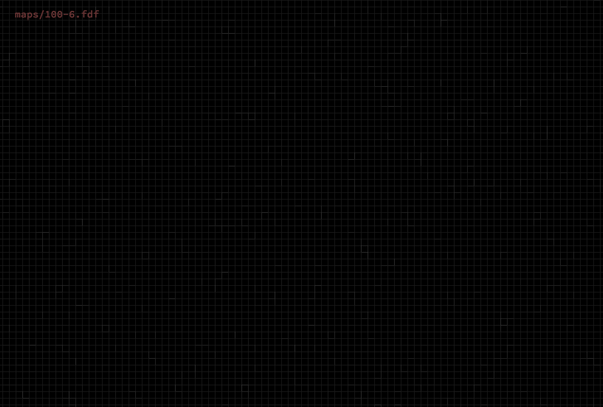
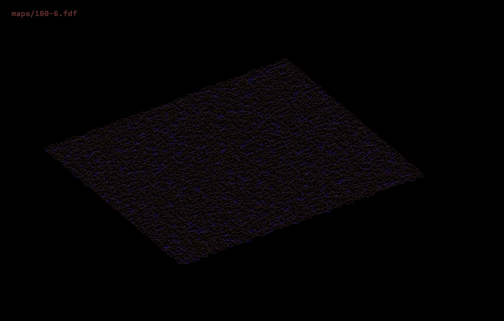
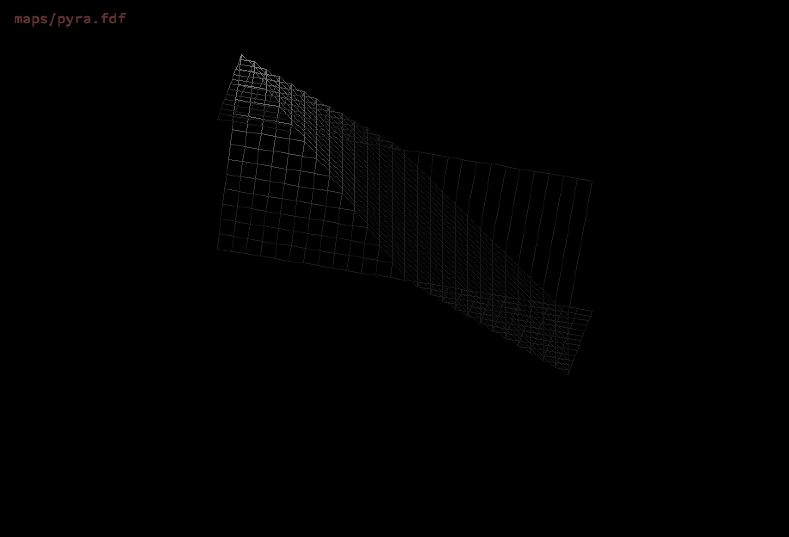
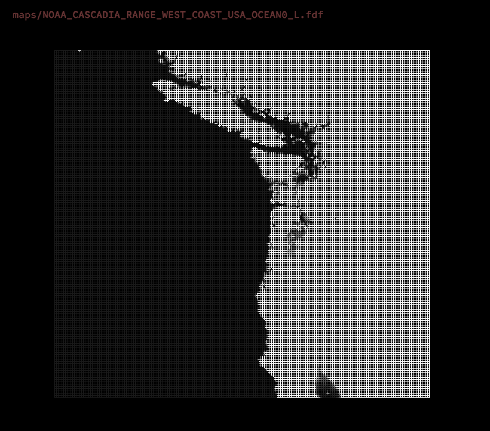
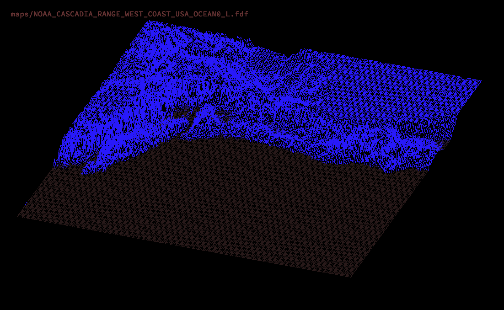
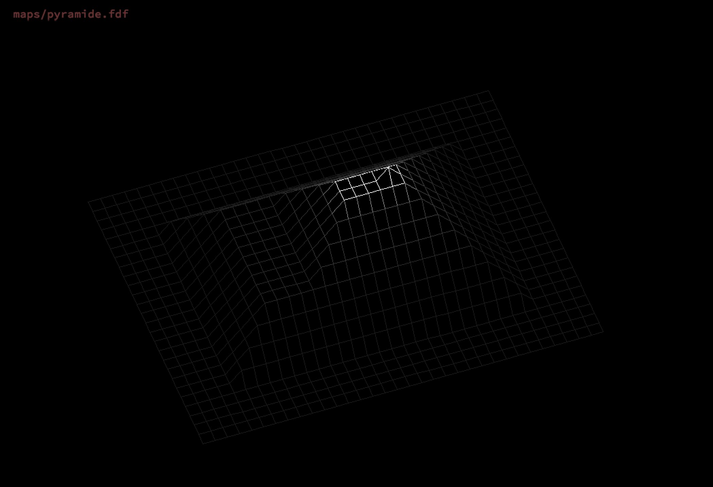

# height_map_engine
Simple rasterization engine for z maps.
- pure c
- all transformations supported
- own implementation of the Bresenham's line algoritmh
- color maps supported (e.g pyramide.fdf)

USAGE:
./application [maps/CHOOSE_ANY_MAP]
- Generate your maps with the 42MapGenerator script

